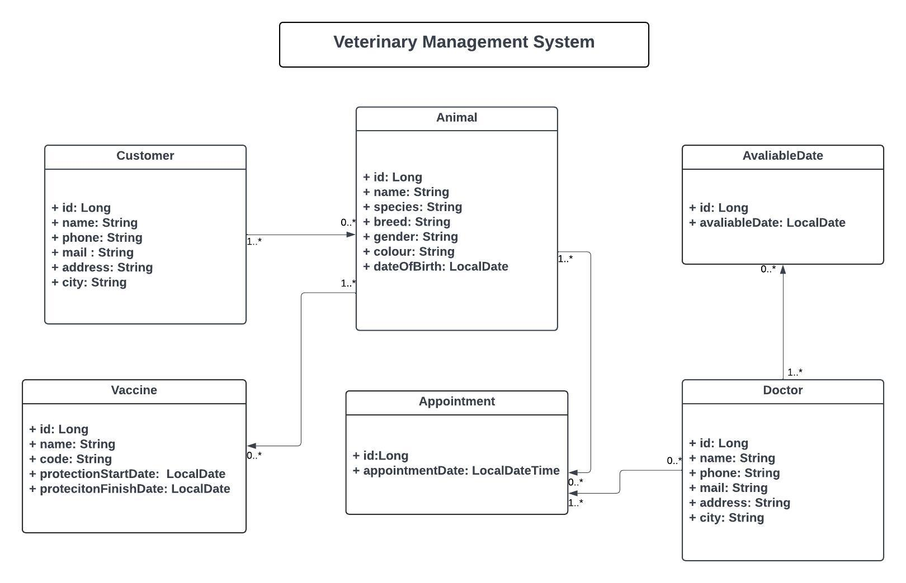

# Veterinary Clinic Manager API

Bu proje, veteriner yönetim sistemi için bir REST API sağlar. CRUD işlemleri yapabilen çeşitli endpointler sunar.

## Endpointler

### Animal Endpoints

| HTTP Method | URL                              | Açıklama                                      |
|-------------|----------------------------------|-----------------------------------------------|
| POST        | /api/animals                     | Yeni bir hayvan ekler                         |
| GET         | /api/animals/{id}                | Belirtilen id ile hayvanı getirir             |
| PUT         | /api/animals                     | Mevcut bir hayvanı günceller                  |
| DELETE      | /api/animals/{id}                | Belirtilen id ile hayvanı siler               |
| GET         | /api/animals                     | Tüm hayvanları getirir                        |
| GET         | /api/animals/customer/{customerId}| Belirtilen müşteri id ile hayvanları getirir  |
| GET         | /api/animals/search?name={name}  | İsme göre hayvanları arar                     |

### Appointment Endpoints

| HTTP Method | URL                              | Açıklama                                      |
|-------------|----------------------------------|-----------------------------------------------|
| POST        | /api/appointments                | Yeni bir randevu oluşturur                    |
| GET         | /api/appointments/{id}           | Belirtilen id ile randevuyu getirir           |
| PUT         | /api/appointments                | Mevcut bir randevuyu günceller                |
| DELETE      | /api/appointments/{id}           | Belirtilen id ile randevuyu siler             |
| GET         | /api/appointments                | Tüm randevuları getirir                       |
| GET         | /api/appointments/animal/{animalId}| Hayvan ID'sine göre randevuları getirir      |
| GET         | /api/appointments/doctor/{doctorId}| Doktor ID'sine göre randevuları getirir      |
| GET         | /api/appointments/date-range     | Tarih aralığına göre randevuları getirir      |

### Available Date Endpoints

| HTTP Method | URL                              | Açıklama                                      |
|-------------|----------------------------------|-----------------------------------------------|
| POST        | /api/availabledates              | Yeni müsait tarih ekler                       |
| GET         | /api/availabledates/{id}         | Belirtilen id ile müsait tarihi getirir       |
| PUT         | /api/availabledates              | Mevcut bir müsait tarihi günceller            |
| DELETE      | /api/availabledates/{id}         | Belirtilen id ile müsait tarihi siler         |
| GET         | /api/availabledates              | Tüm müsait tarihleri getirir                  |
| GET         | /api/availabledates/doctor/{doctorId}| Doktor ID'sine göre müsait tarihleri getirir |

### Customer Endpoints

| HTTP Method | URL                              | Açıklama                                      |
|-------------|----------------------------------|-----------------------------------------------|
| POST        | /api/customers                   | Yeni bir müşteri ekler                        |
| GET         | /api/customers/{id}              | Belirtilen id ile müşteriyi getirir           |
| PUT         | /api/customers                   | Mevcut bir müşteriyi günceller                |
| DELETE      | /api/customers/{id}              | Belirtilen id ile müşteriyi siler             |
| GET         | /api/customers                   | Tüm müşterileri getirir                       |
| GET         | /api/customers/search?name={name}| İsme göre müşterileri arar                    |

### Doctor Endpoints

| HTTP Method | URL                              | Açıklama                                      |
|-------------|----------------------------------|-----------------------------------------------|
| POST        | /api/doctors                     | Yeni bir doktor ekler                         |
| GET         | /api/doctors/{id}                | Belirtilen id ile doktoru getirir             |
| PUT         | /api/doctors                     | Mevcut bir doktoru günceller                  |
| DELETE      | /api/doctors/{id}                | Belirtilen id ile doktoru siler               |
| GET         | /api/doctors                     | Tüm doktorları getirir                        |
| GET         | /api/doctors/search?name={name}  | İsme göre doktorları arar                     |

### Vaccine Endpoints

| HTTP Method | URL                              | Açıklama                                      |
|-------------|----------------------------------|-----------------------------------------------|
| POST        | /api/vaccines                    | Yeni bir aşı ekler                            |
| GET         | /api/vaccines/{id}               | Belirtilen id ile aşıyı getirir               |
| PUT         | /api/vaccines                    | Mevcut bir aşıyı günceller                    |
| DELETE      | /api/vaccines/{id}               | Belirtilen id ile aşıyı siler                 |
| GET         | /api/vaccines                    | Tüm aşıları getirir                           |
| GET         | /api/vaccines/animal/{animalId}  | Hayvan ID'sine göre aşıları getirir           |

## Kurulum ve Çalıştırma

1. Bu projeyi klonlayın:
    ```sh
    git clone https://github.com/your-username/VeterinaryClinicManager.git
    ```

2. Proje dizinine gidin:
    ```sh
    cd VeterinaryClinicManager
    ```

3. Gerekli bağımlılıkları yükleyin ve projeyi çalıştırın:
    ```sh
    mvn clean install
    mvn spring-boot:run
    ```

4. Sql'deki database'imin backup'ını alıp repoya ekledim. Eklediğim .sql formatındaki dosyayı sql'de restore edip database'imi kendi localinize kopyalayabilirsiniz.

5. API'yi Postman veya başka bir araçla kullanabilirsiniz. Postman'de hazır kullandığım endpointleri export edip repoya ekledim, o dosyayı Postman'e import ederek endpointlere ve hazır JSON formatındaki put ve post isteklerine erişebilirsiniz.

## Bağımlılıklar

- Spring Boot
- Spring Data JPA
- Lombok
- ModelMapper
- PostgreSQL

## UML Diyagramı
